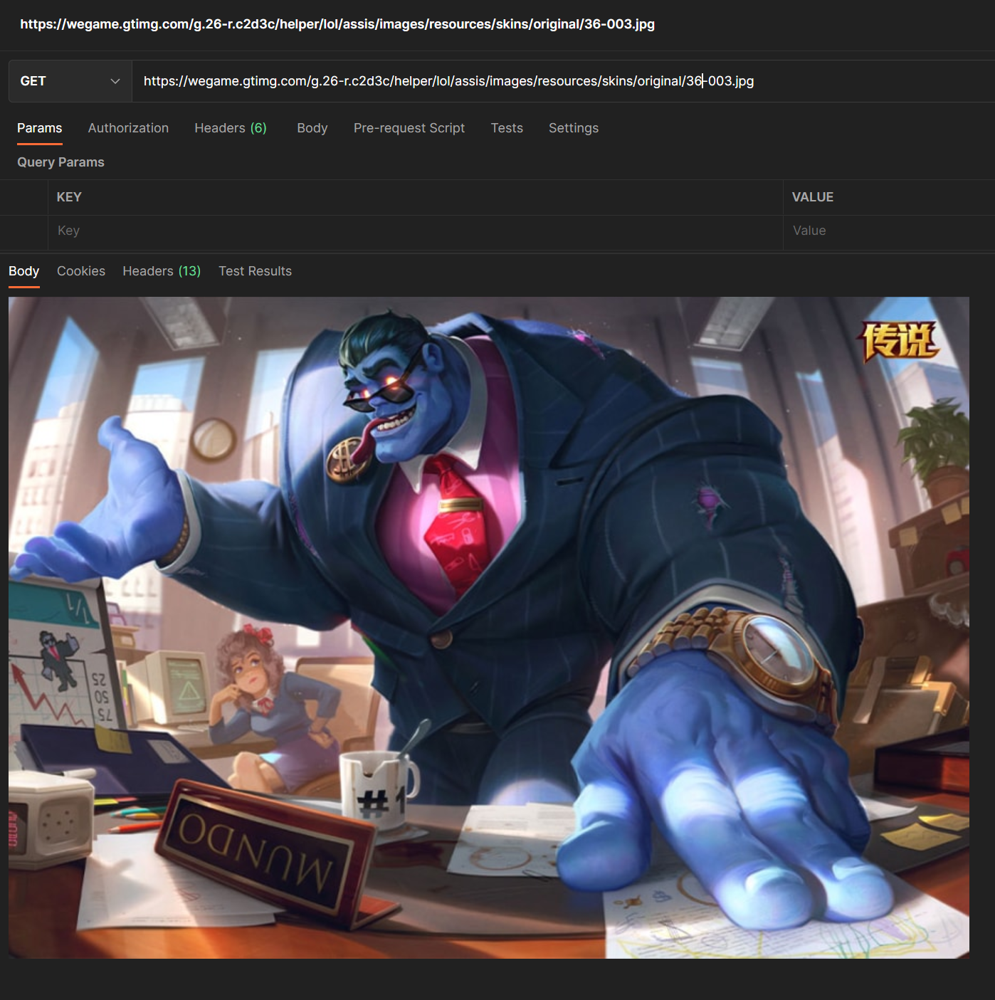

# 英雄联盟相关应用开发工具(项目正在抽空开发中)

## 一、开发项目
## 0. 前言

#### 1. 部分说明
- 所有的拳头API需要https://127.0.0.1:port作为头部，后需要身份验证，用户名riot+密码Token
- 项目依据的[API地址1](https://lcu.vivide.re/)、[API地址2](http://www.mingweisamuel.com/lcu-schema/tool/#/)

#### 2. Token以及本地运行端口获取

```bash
# Windows 需管理员身份
wmic PROCESS WHERE name='LeagueClientUx.exe' GET commandline

# Mac或Linux
ps aux | grep LeagueClientUx
```

返回内容

```bash
# macos
amore            83065  97.5  1.4 42711652 230020   ??  S    10:49下午   0:35.32 /Applications/League of Legends.app/Contents/LoL/League of Legends.app/Contents/Frameworks/LeagueClientUx Helper (Renderer).app/Contents/MacOS/LeagueClientUx Helper (Renderer) --type=renderer --no-sandbox --autoplay-policy=no-user-gesture-required --enable-viewport --log-file=/Users/amore/Library/Logs/LeagueClientUx_debug.log --field-trial-handle=1718379636,1319625535881156466,2563883693768367275,131072 --disable-features=CookiesWithoutSameSiteMustBeSecure,HardwareMediaKeyHandling,SameSiteByDefaultCookies --lang=en-US --framework-dir-path=/Applications/League of Legends.app/Contents/LoL/League of Legends.app/Contents/Frameworks/Chromium Embedded Framework.framework --log-file=/Users/amore/Library/Logs/LeagueClientUx_debug.log --user-agent-product=LeagueOfLegendsClient/12.18.469.7517 (CEF 91) --disable-extensions --disable-scroll-bounce --disable-spell-checking --num-raster-threads=4 --enable-zero-copy --enable-gpu-memory-buffer-compositor-resources --enable-main-frame-before-activation --renderer-client-id=5 --no-v8-untrusted-code-mitigations --shared-files --app-name=LeagueClient --ux-name=LeagueClientUx --ux-helper-name=LeagueClientUxHelper --log-dir=LeagueClient Logs --app-port=52286 --output-base-dir=/Applications/League of Legends.app/Contents/LoL --crash-reporting=crashpad --crash-environment=JP1 --app-log-file-path=/Applications/League of Legends.app/Contents/LoL/Logs/LeagueClient Logs/2022-09-25T22-49-14_83036_LeagueClient.log --primary-ux-log-file-path=/Applications/League of Legends.app/Contents/LoL/Logs/LeagueClient Logs/2022-09-25T22-49-21_83054_LeagueClientUx.log
amore            83059  18.8  0.7  5033072 116260   ??  S    10:49下午   0:20.08 /Applications/League of Legends.app/Contents/LoL/League of Legends.app/Contents/Frameworks/LeagueClientUx Helper (GPU).app/Contents/MacOS/LeagueClientUx Helper (GPU) --type=gpu-process --field-trial-handle=1718379636,1319625535881156466,2563883693768367275,131072 --disable-features=CookiesWithoutSameSiteMustBeSecure,HardwareMediaKeyHandling,SameSiteByDefaultCookies --no-sandbox --framework-dir-path=/Applications/League of Legends.app/Contents/LoL/League of Legends.app/Contents/Frameworks/Chromium Embedded Framework.framework --log-file=/Users/amore/Library/Logs/LeagueClientUx_debug.log --user-agent-product=LeagueOfLegendsClient/12.18.469.7517 (CEF 91) --lang=en-US --gpu-preferences=SAAAAAAAAAAgACgAAAAAAAAAAAAAAAAAAABgAAAAAAAoAAAAAAAAAAAAAAAAAAAAAAAAAAAAAADYAwAAAAAAANgDAAAAAAAASAEAACgAAABAAQAAAAAAAEgBAAAAAAAAUAEAAAAAAABYAQAAAAAAAGABAAAAAAAAaAEAAAAAAABwAQAAAAAAAHgBAAAAAAAAgAEAAAAAAACIAQAAAAAAAJABAAAAAAAAmAEAAAAAAACgAQAAAAAAAKgBAAAAAAAAsAEAAAAAAAC4AQAAAAAAAMABAAAAAAAAyAEAAAAAAADQAQAAAAAAANgBAAAAAAAA4AEAAAAAAADoAQAAAAAAAPABAAAAAAAA+AEAAAAAAAAAAgAAAAAAAAgCAAAAAAAAEAIAAAAAAAAYAgAAAAAAACACAAAAAAAAKAIAAAAAAAAwAgAAAAAAADgCAAAAAAAAQAIAAAAAAABIAgAAAAAAAFACAAAAAAAAWAIAAAAAAABgAgAAAAAAAGgCAAAAAAAAcAIAAAAAAAB4AgAAAAAAABAAAAAAAAAAAAAAAAAAAAAQAAAAAAAAAAAAAAAGAAAAEAAAAAAAAAAAAAAABwAAABAAAAAAAAAAAAAAAAgAAAAQAAAAAAAAAAAAAAAKAAAAEAAAAAAAAAAAAAAACwAAABAAAAAAAAAAAAAAAA0AAAAQAAAAAAAAAAAAAAAOAAAAEAAAAAAAAAABAAAAAAAAABAAAAAAAAAAAQAAAAYAAAAQAAAAAAAAAAEAAAAHAAAAEAAAAAAAAAABAAAACAAAABAAAAAAAAAAAQAAAAoAAAAQAAAAAAAAAAEAAAALAAAAEAAAAAAAAAABAAAADQAAABAAAAAAAAAAAQAAAA4AAAAQAAAAAAAAAAQAAAAAAAAAEAAAAAAAAAAEAAAABgAAABAAAAAAAAAABAAAAAcAAAAQAAAAAAAAAAQAAAAIAAAAEAAAAAAAAAAEAAAACgAAABAAAAAAAAAABAAAAAsAAAAQAAAAAAAAAAQAAAANAAAAEAAAAAAAAAAEAAAADgAAABAAAAAAAAAABwAAAAAAAAAQAAAAAAAAAAcAAAAGAAAAEAAAAAAAAAAHAAAABwAAABAAAAAAAAAABwAAAAgAAAAQAAAAAAAAAAcAAAAKAAAAEAAAAAAAAAAHAAAACwAAABAAAAAAAAAABwAAAA0AAAAQAAAAAAAAAAcAAAAOAAAAEAAAAAAAAAAKAAAAAAAAABAAAAAAAAAACgAAAAYAAAAQAAAAAAAAAAoAAAAHAAAAEAAAAAAAAAAKAAAACAAAABAAAAAAAAAACgAAAAoAAAAQAAAAAAAAAAoAAAALAAAAEAAAAAAAAAAKAAAADQAAABAAAAAAAAAACgAAAA4AAAAIAAAAAAAAAAgAAAAAAAAA --log-file=/Users/amore/Library/Logs/LeagueClientUx_debug.log --shared-files --app-name=LeagueClient --ux-name=LeagueClientUx --ux-helper-name=LeagueClientUxHelper --log-dir=LeagueClient Logs --app-port=52286 --output-base-dir=/Applications/League of Legends.app/Contents/LoL --crash-reporting=crashpad --crash-environment=JP1 --app-log-file-path=/Applications/League of Legends.app/Contents/LoL/Logs/LeagueClient Logs/2022-09-25T22-49-14_83036_LeagueClient.log --primary-ux-log-file-path=/Applications/League of Legends.app/Contents/LoL/Logs/LeagueClient Logs/2022-09-25T22-49-21_83054_LeagueClientUx.log
amore            83066  10.6  2.7 42790404 452376   ??  S    10:49下午   0:18.81 /Applications/League of Legends.app/Contents/LoL/League of Legends.app/Contents/Frameworks/LeagueClientUx Helper (Renderer).app/Contents/MacOS/LeagueClientUx Helper (Renderer) --type=renderer --no-sandbox --autoplay-policy=no-user-gesture-required --enable-viewport --log-file=/Users/amore/Library/Logs/LeagueClientUx_debug.log --field-trial-handle=1718379636,1319625535881156466,2563883693768367275,131072 --disable-features=CookiesWithoutSameSiteMustBeSecure,HardwareMediaKeyHandling,SameSiteByDefaultCookies --lang=en-US --framework-dir-path=/Applications/League of Legends.app/Contents/LoL/League of Legends.app/Contents/Frameworks/Chromium Embedded Framework.framework --log-file=/Users/amore/Library/Logs/LeagueClientUx_debug.log --user-agent-product=LeagueOfLegendsClient/12.18.469.7517 (CEF 91) --disable-extensions --disable-scroll-bounce --disable-spell-checking --num-raster-threads=4 --enable-zero-copy --enable-gpu-memory-buffer-compositor-resources --enable-main-frame-before-activation --renderer-client-id=4 --no-v8-untrusted-code-mitigations --shared-files --app-name=LeagueClient --ux-name=LeagueClientUx --ux-helper-name=LeagueClientUxHelper --log-dir=LeagueClient Logs --app-port=52286 --output-base-dir=/Applications/League of Legends.app/Contents/LoL --crash-reporting=crashpad --crash-environment=JP1 --app-log-file-path=/Applications/League of Legends.app/Contents/LoL/Logs/LeagueClient Logs/2022-09-25T22-49-14_83036_LeagueClient.log --primary-ux-log-file-path=/Applications/League of Legends.app/Contents/LoL/Logs/LeagueClient Logs/2022-09-25T22-49-21_83054_LeagueClientUx.log
amore            83069   1.6  0.3  4736056  43120   ??  S    10:49下午   0:01.08 /Applications/League of Legends.app/Contents/LoL/League of Legends.app/Contents/Frameworks/LeagueClientUx Helper.app/Contents/MacOS/LeagueClientUx Helper --type=utility --utility-sub-type=audio.mojom.AudioService --field-trial-handle=1718379636,1319625535881156466,2563883693768367275,131072 --disable-features=CookiesWithoutSameSiteMustBeSecure,HardwareMediaKeyHandling,SameSiteByDefaultCookies --lang=en-US --service-sandbox-type=audio --no-sandbox --use-mock-keychain --message-loop-type-ui --framework-dir-path=/Applications/League of Legends.app/Contents/LoL/League of Legends.app/Contents/Frameworks/Chromium Embedded Framework.framework --log-file=/Users/amore/Library/Logs/LeagueClientUx_debug.log --user-agent-product=LeagueOfLegendsClient/12.18.469.7517 (CEF 91) --lang=en-US --log-file=/Users/amore/Library/Logs/LeagueClientUx_debug.log --shared-files --app-name=LeagueClient --ux-name=LeagueClientUx --ux-helper-name=LeagueClientUxHelper --log-dir=LeagueClient Logs --app-port=52286 --output-base-dir=/Applications/League of Legends.app/Contents/LoL --crash-reporting=crashpad --crash-environment=JP1 --app-log-file-path=/Applications/League of Legends.app/Contents/LoL/Logs/LeagueClient Logs/2022-09-25T22-49-14_83036_LeagueClient.log --primary-ux-log-file-path=/Applications/League of Legends.app/Contents/LoL/Logs/LeagueClient Logs/2022-09-25T22-49-21_83054_LeagueClientUx.log
amore            83054   1.2  0.9  5140928 148480   ??  S    10:49下午   0:03.99 /Applications/League of Legends.app/Contents/LoL/League of Legends.app/Contents/MacOS/LeagueClientUx --riotclient-auth-token=mJyTwnX_Z7dzzTl9uiegQg --riotclient-app-port=51986 --no-rads --disable-self-update --region=JP --locale=ja_JP --remoting-auth-token=10fLha9EpMgillweqOVTMQ --app-port=52286 --install-directory=/Applications/League of Legends.app/Contents/LoL --app-name=LeagueClient --ux-name=LeagueClientUx --ux-helper-name=LeagueClientUxHelper --log-dir=LeagueClient Logs --crash-reporting=crashpad --crash-environment=JP1 --app-log-file-path=/Applications/League of Legends.app/Contents/LoL/Logs/LeagueClient Logs/2022-09-25T22-49-14_83036_LeagueClient.log --app-pid=83036 --output-base-dir=/Applications/League of Legends.app/Contents/LoL --no-proxy-server
amore            83153   0.0  0.0  4277640    752 s005  S+   10:50下午   0:00.00 grep LeagueClientUx
amore            83073   0.0  0.2 42503468  38208   ??  S    10:49下午   0:00.11 /Applications/League of Legends.app/Contents/LoL/League of Legends.app/Contents/Frameworks/LeagueClientUx Helper (Renderer).app/Contents/MacOS/LeagueClientUx Helper (Renderer) --type=renderer --no-sandbox --autoplay-policy=no-user-gesture-required --enable-viewport --log-file=/Users/amore/Library/Logs/LeagueClientUx_debug.log --field-trial-handle=1718379636,1319625535881156466,2563883693768367275,131072 --disable-features=CookiesWithoutSameSiteMustBeSecure,HardwareMediaKeyHandling,SameSiteByDefaultCookies --lang=en-US --framework-dir-path=/Applications/League of Legends.app/Contents/LoL/League of Legends.app/Contents/Frameworks/Chromium Embedded Framework.framework --log-file=/Users/amore/Library/Logs/LeagueClientUx_debug.log --user-agent-product=LeagueOfLegendsClient/12.18.469.7517 (CEF 91) --disable-extensions --disable-scroll-bounce --disable-spell-checking --num-raster-threads=4 --enable-zero-copy --enable-gpu-memory-buffer-compositor-resources --enable-main-frame-before-activation --renderer-client-id=7 --no-v8-untrusted-code-mitigations --shared-files --app-name=LeagueClient --ux-name=LeagueClientUx --ux-helper-name=LeagueClientUxHelper --log-dir=LeagueClient Logs --app-port=52286 --output-base-dir=/Applications/League of Legends.app/Contents/LoL --crash-reporting=crashpad --crash-environment=JP1 --app-log-file-path=/Applications/League of Legends.app/Contents/LoL/Logs/LeagueClient Logs/2022-09-25T22-49-14_83036_LeagueClient.log --primary-ux-log-file-path=/Applications/League of Legends.app/Contents/LoL/Logs/LeagueClient Logs/2022-09-25T22-49-21_83054_LeagueClientUx.log
amore            83062   0.0  0.3  4695332  50256   ??  S    10:49下午   0:01.08 /Applications/League of Legends.app/Contents/LoL/League of Legends.app/Contents/Frameworks/LeagueClientUx Helper.app/Contents/MacOS/LeagueClientUx Helper --type=utility --utility-sub-type=network.mojom.NetworkService --field-trial-handle=1718379636,1319625535881156466,2563883693768367275,131072 --disable-features=CookiesWithoutSameSiteMustBeSecure,HardwareMediaKeyHandling,SameSiteByDefaultCookies --lang=en-US --service-sandbox-type=network --no-sandbox --use-mock-keychain --framework-dir-path=/Applications/League of Legends.app/Contents/LoL/League of Legends.app/Contents/Frameworks/Chromium Embedded Framework.framework --log-file=/Users/amore/Library/Logs/LeagueClientUx_debug.log --user-agent-product=LeagueOfLegendsClient/12.18.469.7517 (CEF 91) --lang=en-US --log-file=/Users/amore/Library/Logs/LeagueClientUx_debug.log --shared-files --app-name=LeagueClient --ux-name=LeagueClientUx --ux-helper-name=LeagueClientUxHelper --log-dir=LeagueClient Logs --app-port=52286 --output-base-dir=/Applications/League of Legends.app/Contents/LoL --crash-reporting=crashpad --crash-environment=JP1 --app-log-file-path=/Applications/League of Legends.app/Contents/LoL/Logs/LeagueClient Logs/2022-09-25T22-49-14_83036_LeagueClient.log --primary-ux-log-file-path=/Applications/League of Legends.app/Contents/LoL/Logs/LeagueClient Logs/2022-09-25T22-49-21_83054_LeagueClientUx.log
amore@localhost RiotGameApplication % 
```
比如这次我们从中需要截取出来的内容就是`--riotclient-auth-token=mJyTwnX_Z7dzzTl9uiegQg --riotclient-app-port=51986 --no-rads --disable-self-update --region=JP --locale=ja_JP --remoting-auth-token=10fLha9EpMgillweqOVTMQ --app-port=52286 --install-directory=/Applications/`


在`/Users/amore/Library/Application Support/Riot Games/Riot Client/Config/lockfile`中也记录着`Riot Client:82950:51986:KZzsoekl1sp-lDzq6-VSIA:https`的信息，看起来也是pid+port+Token+通信协议，但和实际的貌似不符，可能是弃用了或有其他作用，后续再研究


#### 3. 相关资源内容获取

这里的资源主要指的是LOL的英雄、头像、皮肤图片，fiddler4抓某助手软件的**我的皮肤**功能截获的`https GET`请求，发现请求的地址主要是`https://wegame.gtimg.com/g.26-r.c2d3c/helper/lol/assis/images/resources/`

- 英雄信息列表
`https://game.gtimg.cn/images/lol/act/img/js/heroList/hero_list.js`

- 装备图标

例如：
永霜的小型图标`https://wegame.gtimg.com/g.26-r.c2d3c/helper/lol/assis/images/resources/items/6656.png`
卢登的小型图标`https://wegame.gtimg.com/g.26-r.c2d3c/helper/lol/assis/images/resources/items/6656.png`

 | 
---|---


例如：
- 英雄小幅头像
例如：
酒桶的小幅头像地址`https://wegame.gtimg.com/g.26-r.c2d3c/helper/lol/assis/images/resources/champions/79.png`


- 英雄或皮肤的载入框图标
例如：
女枪的原皮loading pic地址`https://game.gtimg.cn/images/lol/act/img/skinloading/21000.jpg`
幻灵战队皮肤地址`https://game.gtimg.cn/images/lol/act/img/skinloading/21031.jpg`
大致可以分析出最后五位代码，逻辑上前几位应该是英雄id后面是资源序列号，随后求请求`https://wegame.gtimg.com/g.26-r.c2d3c/helper/lol/assis/images/resources/champions/21.png`进行了求证，发现确实是女枪的小幅头像资源
**需要重点说明的是，并不是资源id都是连续的，中间会有断档，而且skinloading里面还会混杂炫彩内容，猜测是有的资源在内部并没有过审，成为废弃内容但是目前也拿不到这部分数据**

 | 
---|---

- 炫彩内容
例如女枪幻灵战队的炫彩内容地址`https://game.gtimg.cn/images/lol/act/img/chromas/21/21025.png`
后面资源序号也是从000开始的，但是很可能前面是没有的，有炫彩的皮肤才会有资源，序列号按照时间顺序排列

|
---|---

- 皮肤小图

用于最小窗预览的皮肤图片`https://wegame.gtimg.com/g.26-r.c2d3c/helper/lol/assis/images/resources/skins/preview/21-015.jpg`

 | 
---|---
- 皮肤大图

皮肤大图地址例如`https://wegame.gtimg.com/g.26-r.c2d3c/helper/lol/assis/images/resources/skins/original/21-018.jpg `
或这个地址貌似也能用`https://game.gtimg.cn/images/lol/act/img/skin/big17002.jpg`

 |  | 
---|---|---

**还找到了一个补充的[LOL资源参考网站](https://lol.qq.com/cguide/Guide/PublicResources/Images.html)**、甚至还找到了一些王者荣耀的资源地址：例如`https://www.sapi.run/hero/herolist.json`，注意看这个请求回来的内容`https://www.sapi.run/hero/select.php?hero=孙悟空&type=qq`去站点里面瞅了一眼好像还是有一些内容的

待参考内容：

## 1. 国服（大陆地区不包括台服）


## 2. 其他区域

`https://asia.api.riotgames.com/lol/summoner/v4/summoners/by-name/top??api_key=RGAPI-5ac8f1e4-744a-4e59-87c8-cef50dfb20c8`

### 2.1 英雄联盟非中国地区可以直接使用Riot提供的[Developer API](https://developer.riotgames.com/)进行开发:


1. 部分常用变量：
    |变量名|含义|
    |-----|---|
    |summoner|召唤师|
    |

2. 常用API接口：

    |Method|URL|解释||
    |--|--|--|--|
    |GET|/lol/summoner/v4/summoners/by-name/{summonerName}|根据**召唤师名称**返回一个召唤师对象变量|```ssss```


## 二、项目需求

### 1. 需求分析
1. 国服+日服的战绩查询

    本人混迹于英雄联盟国区和日区，由于op.gg只能查询国服以外的数据，又因为op.gg在几个月前应该是完全被墙掉了，有点不方便查询数据，所以才有这样一个基本需求

2. 登陆状态隐藏
   
    这是舍友的烦恼，一个区好友太多，但是有时候登陆游戏又想一个人打，现在英雄联盟客户端无法将自己的登录状态显示为隐身，被好友看到又不好意思拒绝组队，所以希望增加一个登陆状态隐藏的功能

3. 天赋页本地缓存一键配置

    英雄联盟天赋页面非常稀有，但是我本人玩的英雄种类又非常丰富，同一个英雄在不同的模式下又会佩戴不同符文，特别是在大乱斗的情况下，由于可能会最后才换到想玩的英雄，但是又苦于没有时间修改天赋，导致一局游戏体验非常不好，才有了这样一个希望能把常用天赋都记录下来，自动一键选配，并进行收藏的功能

4. 队友战绩分析

    在进行紧张刺激的排位过程中，当你选择了打野位，很多情况下如果不是你能很早carry比赛，那就必须拥有长远的眼光，快速找到本队大爹以及对方大爹，接下来为了取得最终的胜利只有两件事情要做：死保本队大爹+死搞对方大爹（给予你自己是有一定水平的情况下，不会用自己来加速对方大爹的发育），这是如果有一个基于历史数据的分析引擎，快速告诉你结果，那就可以提前规划gank路线，这里需要一个可以不断优化的找爹模块，快速准确高效寻找大腿（老年人排位是这样的）

5. MVP票选

    我已经不爽不论是Wegame还是op.gg的MVP选择很久了，这款应用会根据自己的算法进行MVP票选，并不断根据实际情况更新迭代（如果最后还是一样的结果，那当我没说），让当好狗的狗也有机会，让默默抗下一切的Mr key也能带上👑

6. 个人数据分析系统

    类似客户端目前的分析系统，但最好分成大乱斗以及匹配和排位，这样可以让我在上分的时候分析不足不断进步，让我在乱斗中找乐子时经常看到夸夸数据更乐一点

0. 最后终极需求
   做一个不带GUI的terminal版本，跨平台就ok（Mac上打日服的需求）

### 2. 任务进度

排名按照考虑时的先后顺序和当前认为的重要程度排序

- [ ] 国服战绩查询
- [ ] 日服战绩查询
- [ ] 队友战绩分析

### 3. 遗留问题

1. 离线战绩查询
2. 
## 三、项目配置注意事项

主要适配的环境还是**opengl+glfw**

- 首先不管是Windows还是Linux、Macos都需要cmake+clang-13 / gcc-8.1.0(gcc目前只测试了该版本)

    Windows平台：
    - [cmake](https://cmake.org/download/)下载安装：
    不要安装源码编译，除非你已经有cmake想升级版本或有VS应该也行，源码cmake需要cmake进行编译（滑稽），安装成功后可以在命令行里面敲`cmake --version`检查是否安装成功
    随后还需要根据你的g++位置进行设置`cmake -DCMAKE_CXX_COMPILER=/pathto/g++ -DCMAKE_C_COMPILER=/pathto/gcc /pathto/source`，否则在使用cmake时会出现`CMake Error: CMAKE_C_COMPILER not set, after EnableLanguage`
    

- 随后为了执行带GUI的应用，需要安装GLFW3+OpenGL3

    - [GLFW3](https://www.glfw.org/)或直接下载[预编译](https://www.glfw.org/download.html)好的GLFW（建议别折磨自己编译）=> **已在项目中配置完成**
    
    还是建议直接装这个好的，**这里为了方便，我直接把需要的dll文件用CMakeList.txt在本项目目录中配置好了X86系统的，现在ARM可能得自己配**
    

    - OpenGL：Windows应该默认就有安装，不需要管


- [ImGui库可视化示例站点](https://pthom.github.io/imgui_manual_online/manual/imgui_manual.html)

（才刚开始写，先记录部分注意事项，格式什么的随后调整）
1. 配置编译项目的时候注意cmake参数，部分库考虑到后续可能会换，全部写成option选项，配置时需要说明开启
   - `cd build`
   - `cmake .. -DUSE_IMGUI=ON -DUSE_GLOG=ON`
   - `cmake --build .`
   - `./RGALE`
或需要install时：
   - cmake --install . --prefix './install'


